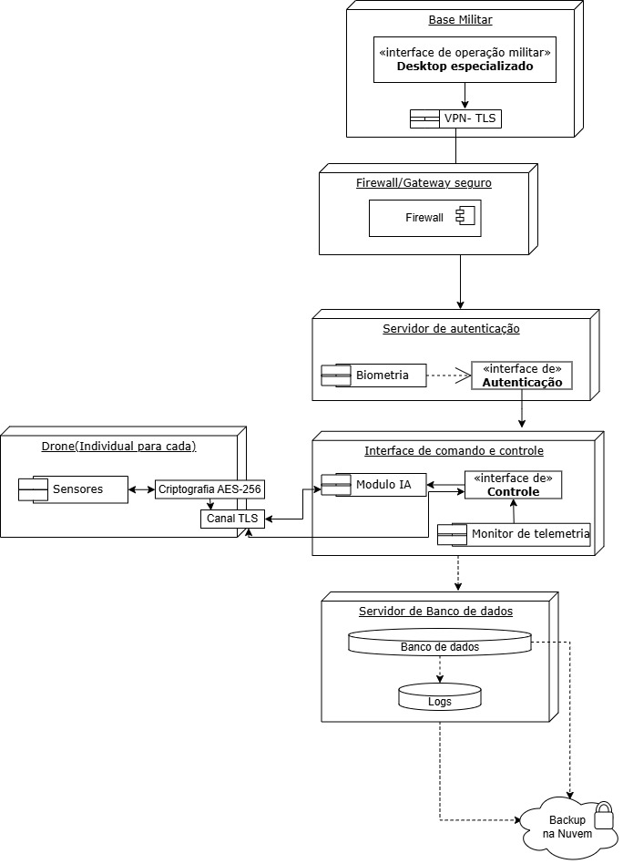

<h2><a href= "https://www.mackenzie.br">Universidade Presbiteriana Mackenzie</a></h2>

# Sistema Falcão Sombrio para Drones

**Conteúdo**

- [Autores](#nome-alunos)
- [Descrição do Projeto](#introdução-do-projeto)
- [Análise de Requisitos Funcionais e Não-Fucionais](#descrição-dos-requisitos)
- [Diagrama de Atividades](#diagrama-de-atividades) 
- [Diagrama de Casos de Uso](#diagrama-de-comportamento-atores)
- [Descrição dos Casos de Uso](#descrição-das-funcões)
- [Diagrama de Senquencia](#diagrama-de-ordem-interações)
- [Diagrama de Classes](#diagrama-orientado-objetos)
- [Diagrama de Estados](#diagrama-estrutura-componente)
- [Diagrama de Implantação](#diagrama-de-hardware-software)
- [Referências](#referências)

# Autores

* Bruna Gonçalves Corte David - 10425696  
* Júlia Andrade - 10428513  
* Kleber Gadelha Ponte Souza Filho - 10321335  
* Gabriel de Matos de Campos Mello - 10322927  

# Descrição do Projeto

O projeto tem como objetivo a elaboração de documentação para o sistema inovador **Falcão Sombrio**, concebido para o gerenciamento e operação remota e autônoma de frotas de drones.

# Análise de Requisitos Funcionais e Não-Funcionais

### Requisitos Funcionais:
- **Gerenciamento de Frotas**: Operação remota e autônoma dos drones através de uma rede de servidores distribuídos e uma interface operacional avançada.  
- **Monitoramento em Tempo Real**: Transmitir dados de telemetria, status e eventos críticos.  
- **Interface de Comando e Controle**: Dashboard em tempo real com telemetria.  
- **Priorização de Processos**: Conforme o status crítico da missão.  
- **Operação Autônoma**: Baseada em redes neurais com detecção e evasão de ameaças e sensoriamento (via LIDAR, câmeras e GPS).  
- **Comunicação Segura**: Comunicação em tempo real e criptografada com os drones (essencial para o funcionamento).  
- **Logs de Missões**: Dados detalhados de cada missão e eventos críticos.  
- **Logs de Auditoria**: Imutáveis, para fins de segurança e conformidade.  
- **Atualização Automática**  
- **Failover Automático**: Redirecionamento automático das operações para um servidor de backup.  

### Requisitos Não Funcionais:
- **Segurança**: Criptografia de ponta, assinaturas digitais, autenticação biométrica e multifator.  
- **Latência**: Limite máximo de 50ms.  
- **Logs**: Armazenamento conforme leis e políticas de segurança.  
- **Banco de Dados**: Sincronização em tempo real dos dados dos drones.  
- **Gerenciamento de Múltiplas Threads**: Para sensores, navegação e IA.  
- **Conformidade**: Atende aos padrões ISO 27001 e NIST 800-53.  
- **Recuperação de Falhas**: Automatizada.  
- **Eficiência Energética**: Otimização do consumo de bateria.  

# Diagrama de Atividades

# Diagrama de Casos de Uso

# Descrição dos Casos de Uso

# Diagrama de Sequência

# Diagrama de Classes

# Diagrama de Estados

# Diagrama de Implantação

# Referências

*<Lista de referências>*
